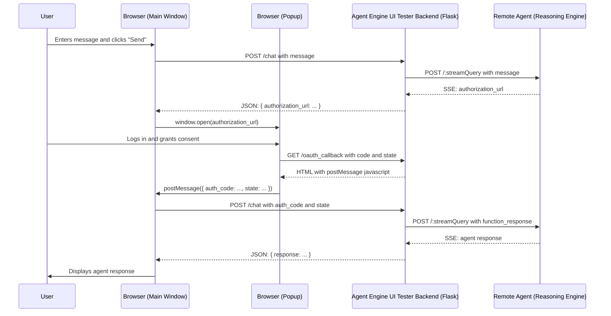

# Agent Engine UI Tester

This document provides a guide on how to use and understand the Agent Engine UI Tester application, a Flask-based web application for interacting with ADK agents and testing the OAuth2 flow.

## Overview

The Agent Engine UI Tester is a simple web application that provides a chat interface for interacting with a deployed Reasoning Engine. It demonstrates how a custom application can authenticate with a Reasoning Engine and handle the user-centric OAuth2 flow required by agents that use tools protected by OAuth.

## Application Architecture

The `agentengine_ui_tester` application is composed of three main components:

1.  **Front-end (Client/Browser):** This is what you see and interact with in your web browser. It is built with HTML, CSS, and Javascript.
2.  **Back-end (Flask Application):** This is the Python server (`main.py`) that runs on your local machine. It acts as a bridge between the front-end and the remote agent.
3.  **Remote Agent (Reasoning Engine):** This is the ADK agent that is deployed on Agent Engine.

Here is a diagram that illustrates the architecture:

```mermaid
graph LR
    A[Front-end (Client/Browser)] -- Request --> B(Back-end (Flask Application));
    B -- Request --> C{Remote Agent (Reasoning Engine)};
    C -- Response --> B;
    B -- Response --> A;
```

## How to Run the Application

### 1. Install Dependencies

Install the necessary Python packages using pip:

```bash
pip install -r requirements.txt
```

### 2. Configure the Environment

Create a `.env` file in the `agentengine_ui_tester` directory and add the following line:

```
DEFAULT_AGENT_URL=<your_agent_url>
```

Replace `<your_agent_url>` with the URL of your deployed Reasoning Engine.

### 3. Run the Application

Start the Flask web server:

```bash
python main.py
```

The application will be available at `http://127.0.0.1:8080`.

## How to Use the UI

When you open the application in your browser, you will see the following elements:

*   **Agent URL:** A text box that shows the URL of the agent the application is configured to communicate with. You can edit this URL to test against different agents.
*   **Session ID:** Displays the ID of the current chat session. A session is required to have a conversation with the agent.
*   **New Session Button:** Creates a new chat session.
*   **Delete Session Button:** Deletes the current chat session.
*   **Chat Window:** Displays the conversation with the agent.
*   **Message Input:** The text box where you can type your messages to the agent.

## Implementing the OAuth2 Flow in a Front-end Application

The core of this application is its handling of the OAuth2 flow. Here is a step-by-step guide on how it works, with code snippets from this application as examples.

### Step 1: Initiating the Chat and Triggering the OAuth Flow

When the user sends a message that requires an OAuth-protected tool, the agent responds with a request for authentication.

1.  The user sends a message. The front-end makes a `POST` request to the `/chat` endpoint.

    *templates/index.html:*
    ```javascript
    messageForm.addEventListener('submit', async (e) => {
        e.preventDefault();
        const message = messageInput.value;
        const agent_url = agentUrlInput.value;
        if (!message || !currentSessionId || !agent_url) return;

        appendMessage('You', message, 'user-message');
        messageInput.value = '';
        appendMessage('Agent', 'Thinking...', 'agent-message');

        try {
            const response = await fetch('/chat', {
                method: 'POST',
                headers: { 'Content-Type': 'application/json' },
                body: JSON.stringify({ message, agent_url })
            });

            if (!response.ok) {
                const errorData = await response.json();
                throw new Error(errorData.error || `HTTP error! status: ${response.status}`);
            }
            const data = await response.json();
            messagesDiv.removeChild(messagesDiv.lastChild);

            if (data.authorization_url) {
                appendMessage('Agent', 'Authentication required. Please complete the process in the popup window.', 'agent-message');
                window.open(data.authorization_url, 'oauth_popup', 'width=600,height=700');
            } else if (data.response) {
                appendMessage('Agent', data.response, 'agent-message');
            } else if (data.error) {
                appendMessage('Error', data.error, 'agent-message');
            }
        } catch (error) {
            messagesDiv.removeChild(messagesDiv.lastChild);
            appendMessage('Error', error.message, 'agent-message');
        }
    });
    ```

2.  The `/chat` endpoint in `main.py` forwards the message to the agent.

3.  The agent determines that the requested tool requires authentication and responds with an `authorization_url`.

4.  The `/chat` endpoint parses the agent's response, finds the `authorization_url`, and sends it back to the front-end.

    *main.py:*
    ```python
    # ... inside the /chat endpoint ...
    if auth_uri_to_return:
        session['auth_config'] = auth_config_to_store
        session['function_call_id'] = function_call_id_to_store
        return jsonify({'authorization_url': auth_uri_to_return})
    ```

### Step 2: Handling the OAuth Popup

The front-end opens the `authorization_url` in a new popup window. This URL leads to the Google login and consent screen, where the user can approve the scopes requested by the agent.

### Step 3: The OAuth Callback

After the user approves the request, the OAuth provider redirects the user back to the `redirect_uri` that was specified in the `authorization_url`. In our case, this is the `/oauth_callback` endpoint.

1.  The `/oauth_callback` endpoint receives the `code` and `state` as query parameters.

2.  It then renders a simple HTML page with a javascript snippet that uses `window.opener.postMessage` to send the `code` and `state` back to the main window.

    *main.py:*
    ```python
    @app.route('/oauth_callback')
    def oauth_callback():
        code = request.args.get('code')
        state = request.args.get('state')
        html_content = """
        <!DOCTYPE html><html><head><title>Authentication Complete</title></head><body>
        <p>Authentication successful. Please wait...</p><script>
            window.onload = function() {
                if (window.opener) {
                    window.opener.postMessage({ type: 'oauth_complete', auth_code: '{{ code }}', state: '{{ state }}' }, window.opener.location.origin);
                    window.close();
                } else { document.body.innerHTML = "<h1>Error: Not in a popup.</h1>"; }
            };
        </script></body></html>
        """
        return render_template_string(html_content, code=code, state=state)
    ```

### Step 4: Completing the Authentication

The main window receives the `postMessage` event and now has the `code` and `state` needed to complete the authentication.

1.  The `message` event listener in `templates/index.html` is triggered.

2.  It makes a `POST` request to the `/chat` endpoint, this time including the `auth_code` and `state`.

    *templates/index.html:*
    ```javascript
    window.addEventListener('message', async (event) => {
        if (event.origin !== window.location.origin) return;
        if (!event.data || event.data.type !== 'oauth_complete') return;

        const { auth_code, state } = event.data;
        if (auth_code) {
            appendMessage('System', 'Authentication complete. Fetching final response...', 'system-message');
            const agent_url = agentUrlInput.value;

            try {
                const response = await fetch('/chat', {
                    method: 'POST',
                    headers: { 'Content-Type': 'application/json' },
                    body: JSON.stringify({ auth_code, state, agent_url })
                });

                if (!response.ok) {
                    const errorData = await response.json();
                    throw new Error(errorData.error || `HTTP error! status: ${response.status}`);
                }
                const data = await response.json();
                if (data.error) {
                    appendMessage('Error', data.error, 'agent-message');
                } else {
                    appendMessage('Agent', data.response, 'agent-message');
                }
            } catch (error) {
                appendMessage('Error', `Auth fetch error: ${error.message}`, 'agent-message');
            }
        }
    }, false);
    ```

3.  The `/chat` endpoint in `main.py` now has the `auth_code`. It retrieves the `auth_config` and `function_call_id` that it had previously stored in the session, constructs a `function_response` payload, and sends it to the agent.

    *main.py:*
    ```python
    # ... inside the /chat endpoint ...
    elif 'auth_code' in req_data:
        auth_config = session.get('auth_config')
        function_call_id = session.get('function_call_id')
        # ...
        payload = {
            "user_id": user_id,
            "session_id": session_id,
            "message": {
                "role": "user",
                "parts": [{
                    "function_response": {
                        "name": "adk_request_credential",
                        "id": function_call_id,
                        "response": auth_config
                    }
                }]
            }
        }
        data = {"class_method": "async_stream_query", "input": payload}
    ```

4.  The agent receives the `function_response`, exchanges the `auth_code` for an access token, and can now execute the OAuth-protected tool.

## Agent Engine Interaction

The application consists of a simple HTML frontend and a Flask backend that communicates with the Reasoning Engine. The backend handles session management, authentication, and the OAuth2 flow.

### Authentication and OAuth2 Flow

The application demonstrates the following flow to authenticate with the agent and authorize access to protected tools:

1.  **Session Creation:** The user creates a session with the agent.
2.  **Initial Chat:** The user sends a message to the agent.
3.  **OAuth Trigger:** If the agent needs to use a tool that requires authentication, it responds with a request for credentials, including an `authUri`.
4.  **User Authentication:** The frontend opens the `authUri` in a popup window, where the user can sign in and grant consent.
5.  **OAuth Callback:** After authentication, the user is redirected to the `/oauth_callback` endpoint, which captures the authorization code.
6.  **Code Exchange:** The frontend sends the authorization code back to the backend, which then sends it to the agent to complete the authentication process.

### Example Agent Backend Calls

Here is an example of the requests and responses exchanged between the Agent Engine UI Tester and the Reasoning Engine during the OAuth2 flow.

**Initial Chat Request**

The user sends a message to the agent.

```
--- Chat Request (Initial) ---
URL: https://us-central1-aiplatform.googleapis.com/v1/projects/muchandi-proj1/locations/us-central1/reasoningEngines/3292892189654253568:streamQuery?alt=sse
Headers: {"Content-Type": "application/json", "Authorization": "Bearer [BEARER_TOKEN]", "Connection": "close"}
Body: {
  "class_method": "async_stream_query",
  "input": {
    "user_id": "user-from-custom-ae-tester",
    "session_id": "1200381099386077184",
    "message": {
      "role": "user",
      "parts": [
        {
          "text": "route from atlanta ga to apex nc by car"
        }
      ]
    }
  }
}
--------------------------
```

**Agent Response with Auth URI**

The agent responds with a request for credentials, including the `authUri`.

```
SSE Data: {"content": {"parts": [{"function_call": {"id": "adk-0478ad02-ed00-4416-b932-d6ed032c62ae", "args": {"functionCallId": "adk-a1431b9b-1951-4639-8db8-1c20145f989c", "authConfig": {"authScheme": {"type": "oauth2", "flows": {"authorizationCode": {"scopes": {"https://www.googleapis.com/auth/cloud-platform": "", "https://www.googleapis.com/auth/user.addresses.read": "", "https://www.googleapis.com/auth/userinfo.profile": ""}}, "authorizationUrl": "https://accounts.google.com/o/oauth2/auth", "tokenUrl": "https://oauth2.googleapis.com/token"}}}, "rawAuthCredential": {"authType": "oauth2", "oauth2": {"clientId": "[CLIENT_ID]", "clientSecret": "[CLIENT_SECRET]", "redirectUri": "http://127.0.0.1:8080/oauth_callback"}}, "exchangedAuthCredential": {"authType": "oauth2", "oauth2": {"clientId": "[CLIENT_ID]", "clientSecret": "[CLIENT_SECRET]", "authUri": "https://accounts.google.com/o/oauth2/auth?response_type=code&client_id=[CLIENT_ID]&redirect_uri=http%3A%2F%2F127.0.0.1%3A8080%2Foauth_callback&scope=https%3A%2F%2Fwww.googleapis.com%2Fauth%2Fcloud-platform+https%3A%2F%2Fwww.googleapis.com%2Fauth%2Fuser.addresses.read+https%3A%2F%2Fwww.googleapis.com%2Fauth%2Fuserinfo.profile&state=MIIfNCOI9CfkaFVSJIhLsiPDUSXiDg&access_type=offline&prompt=consent", "state": "MIIfNCOI9CfkaFVSJIhLsiPDUSXiDg", "redirectUri": "http://127.0.0.1:8080/oauth_callback"}}, "credentialKey": "adk_oauth2_3119459921658935125_oauth2_-568389594588614771"}}, "name": "adk_request_credential"}], "role": "user"}, "invocation_id": "e-43128e19-237f-4c0e-8fef-b50d0f09e717", "author": "route_planning_agent", "actions": {"state_delta": {}, "artifact_delta": {}, "requested_auth_configs": {}, "requested_tool_confirmations": {}}, "long_running_tool_ids": ["adk-0478ad02-ed00-4416-b932-d6ed032c62ae"], "id": "773f0f85-821b-42e2-8af6-0e361b34fe00", "tim... [truncated]
```

**Chat Request with Auth Code**

After the user authenticates, the authorization code is sent back to the agent.

```
--- Chat Request (Auth Code) ---
URL: https://us-central1-aiplatform.googleapis.com/v1/projects/muchandi-proj1/locations/us-central1/reasoningEngines/3292892189654253568:streamQuery?alt=sse
Headers: {"Content-Type": "application/json", "Authorization": "Bearer [BEARER_TOKEN]", "Connection": "close"}
Body: {
  "class_method": "async_stream_query",
  "input": {
    "user_id": "user-from-custom-ae-tester",
    "session_id": "1200381099386077184",
    "message": {
      "role": "user",
      "parts": [
        {
          "function_response": {
            "name": "adk_request_credential",
            "id": "adk-0478ad02-ed00-4416-b932-d6ed032c62ae",
            "response": {
              "authScheme": {
                "flows": {
                  "authorizationCode": {
                    "authorizationUrl": "https://accounts.google.com/o/oauth2/auth",
                    "scopes": {
                      "https://www.googleapis.com/auth/cloud-platform": "",
                      "https://www.googleapis.com/auth/user.addresses.read": "",
                      "https://www.googleapis.com/auth/userinfo.profile": ""
                    },
                    "tokenUrl": "https://oauth2.googleapis.com/token"
                  }
                },
                "type": "oauth2"
              },
              "credentialKey": "adk_oauth2_3119459921658935125_oauth2_-568389594588614771",
              "exchangedAuthCredential": {
                "authType": "oauth2",
                "oauth2": {
                  "authUri": "https://accounts.google.com/o/oauth2/auth?response_type=code&client_id=[CLIENT_ID]&redirect_uri=http%3A%2F%2F127.0.0.1%3A8080%2Foauth_callback&scope=https%3A%2F%2Fwww.googleapis.com%2Fauth%2Fcloud-platform+https%3A%2F%2Fwww.googleapis.com%2Fauth%2Fuser.addresses.read+https%3A%2F%2Fwww.googleapis.com%2Fauth%2Fuserinfo.profile&state=MIIfNCOI9CfkaFVSJIhLsiPDUSXiDg&access_type=offline&prompt=consent",
                  "clientId": "[CLIENT_ID]",
                  "clientSecret": "[CLIENT_SECRET]",
                  "redirectUri": "http://127.0.0.1:8080/oauth_callback",
                  "state": "MIIfNCOI9CfkaFVSJIhLsiPDUSXiDg",
                  "authResponseUri": "http://127.0.0.1:8080/oauth_callback?state=MIIfNCOI9CfkaFVSJIhLsiPDUSXiDg&code=[AUTH_CODE]"
                }
              },
              "rawAuthCredential": {
                "authType": "oauth2",
                "oauth2": {
                  "clientId": "[CLIENT_ID]",
                  "clientSecret": "[CLIENT_SECRET]",
                  "redirectUri": "http://127.0.0.1:8080/oauth_callback"
                }
              }
            }
          }
        }
      ]
    }
  }
}
--------------------------
```

**Final Agent Response**

The agent uses the authorization code to obtain an access token, executes the tool, and returns the final response.

```
Auth Code Stream Data: {"content": {"parts": [{"function_response": {"id": "adk-a1431b9b-1951-4639-8db8-1c20145f989c", "name": "get_directions", "response": {"result": "Directions from 'atlanta ga' to 'apex nc' by drive:
  - Total Distance: 635.2 km
  - Estimated Duration: about 362 minutes.
  - Steps:
    1. Head southwest toward Capitol Sq SW
    2. Turn left onto Capitol Sq SW
    3. Turn left onto Capitol Ave SW
    4. Turn right onto M.L.K. Jr Dr SE
    5. Turn left to merge onto I-75 N/I-85 N
    6. Take exit 251B on the left for I-85 N toward GA-400/Greenville
    7. Continue onto I-85 N
    8. Keep right to stay on I-85 N, follow signs for Greenville
Entering South Carolina
    9. Continue straight to stay on I-85 N
Entering North Carolina
    10. Take exit 30 for I-485 toward I-77/Pineville/Huntersville
    11. Take the I-485 Inner N ramp to I-77 N/Statesville
    12. Merge onto I-485/I-485 Inner
    13. Take exit 30 to merge onto I-85 N toward Greensboro
    14. Keep left to stay on I-85 N, follow signs for US 421 S/Durham Sanford
    15. Take exit 126A-126B to merge onto US-421 S toward Sanford
    16. Slight right
    17. Merge onto US-421 S
    18. Take exit 171 for US-64 E toward Pittsboro
    19. Turn left onto US-64 E
Pass by Wendy's (on the right in 0.4 mi)
    20. Take the exit toward Apex/Downtown
    21. Turn right onto N Salem St
    22. Continue straight to stay on N Salem St"}}}], "role": "user"}, "invocation_id": "e-fb1e8cda-73ed-4a70-8a7c-b25dacaf11bf", "author": "route_planning_agent", "actions": {"state_delta": {"route_planner_creds": "{"token": "[ACCESS_TOKEN]", "refresh_token": "[REFRESH_TOKEN]", "token_uri": "https://oauth2.googleapis.com/token", "client_id": "[CLIENT_ID]", "client_secret": "[CLIENT_SECRET]", "universe_domain": "googleapis.com", "account": ""}"}, "artifact_delta": {}, "requested_auth_configs": {}, "requested_tool_confirmation... [truncated]
```

## Sequence Diagram



## API Endpoints

-   `GET /`: Renders the main chat interface.
-   `GET /agent-url`: Returns the configured agent URL.
-   `GET /list-agents`: Lists available Reasoning Engines.
-   `GET /session`: Returns the current session ID.
-   `POST /session`: Creates a new session.
-   `DELETE /session`: Deletes the current session.
-   `POST /chat`: Handles the chat logic and OAuth flow.
-   `GET /oauth_callback`: Handles the OAuth2 callback.
