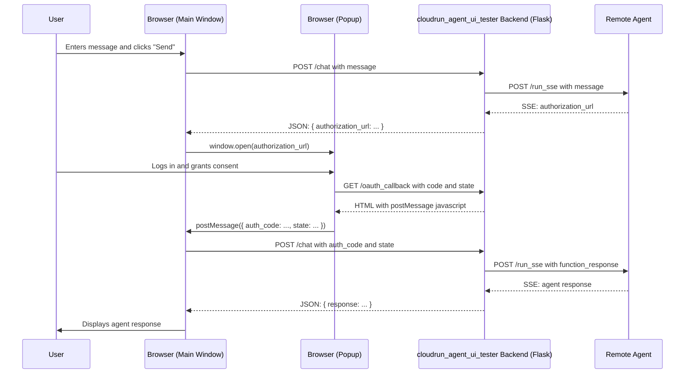

# cloudrun_agent_ui_tester for Testing ADK Agents

This document provides a guide on how to use and understand the cloudrun_agent_ui_tester application, with a special focus on its implementation of the OAuth2 flow for authenticating with ADK agents.

## Overview

The cloudrun_agent_ui_tester is a Flask-based web application that provides a simple chat interface for interacting with ADK agents deployed remotely. It demonstrates how a front-end application can handle the user-centric OAuth2 flow required by agents that use tools protected by OAuth.

## Application Architecture

The `cloudrun_agent_ui_tester` application is composed of three main components:

1.  **Front-end (Client/Browser):** This is what you see and interact with in your web browser. It is built with HTML, CSS, and Javascript.
2.  **Back-end (Flask Application):** This is the Python server (`main.py`) that runs on your local machine. It acts as a bridge between the front-end and the remote agent.
3.  **Remote Agent:** This is the ADK agent that is deployed on a server, such as Google Cloud Run.

Here is a diagram that illustrates the architecture:

```mermaid
graph LR
    A[Front-end (Client/Browser)] -- Request --> B(Back-end (Flask Application));
    B -- Request --> C{Remote Agent};
    C -- Response --> B;
    B -- Response --> A;
```

**Explanation of Terminology:**

*   **Front-end (Client/Browser):**
    *   **What it is:** The HTML, CSS, and Javascript code in the `templates/index.html` file that is rendered by your web browser.
    *   **What it does:**
        *   Displays the chat interface.
        *   Captures your messages.
        *   Sends your messages to the Back-end.
        *   Receives responses from the Back-end and displays them in the chat window.
        *   Opens the OAuth popup window.

*   **Back-end (Flask Application):**
    *   **What it is:** The Python script `main.py` running as a Flask server.
    *   **What it does:**
        *   Serves the Front-end to your browser.
        *   Receives requests from the Front-end (e.g., when you send a message).
        *   Forwards your messages to the Remote Agent.
        *   Receives responses from the Remote Agent.
        *   Parses the agent's responses (e.g., to find the `authorization_url`).
        *   Sends the processed responses back to the Front-end.
        *   Manages the chat session.

*   **Remote Agent:**
    *   **What it is:** The deployed ADK agent.
    *   **What it does:**
        *   Receives and understands your messages.
        *   Uses its tools to perform tasks (e.g., get directions).
        *   Initiates the OAuth flow when a protected tool is needed.
        *   Sends its responses back to the Back-end.

So, in the statement "The /chat endpoint parses the agent's response, finds the authorization_url, and sends it back to the front-end," it means the **Back-end** is receiving a response from the **Remote Agent**, and then sending the relevant information to the **Front-end**.

## How to Run the Application

### 1. Install Dependencies

Install the necessary Python packages using pip:

```bash
pip install -r requirements.txt
```

### 2. Configure the Agent URL

The application needs to know the URL of the agent it will be communicating with. You can configure this in two ways:

*   **Environment Variable (Recommended):** Set the `AGENT_URL` environment variable before running the application.

    ```bash
    export AGENT_URL=<your_agent_url>
    python main.py
    ```

*   **Default Value:** If the `AGENT_URL` environment variable is not set, the application will default to `http://localhost:8000`.

### 3. Run the Application

Start the Flask web server:

```bash
python main.py
```

The application will be available at `http://127.0.0.1:8080`.

## How to Use the UI

When you open the application in your browser, you will see the following elements:

*   **Agent URL:** A text box that shows the URL of the agent the application is configured to communicate with. You can edit this URL to test against different agents.
*   **Session ID:** Displays the ID of the current chat session. A session is required to have a conversation with the agent.
*   **New Session Button:** Creates a new chat session.
*   **Delete Session Button:** Deletes the current chat session.
*   **Chat Window:** Displays the conversation with the agent.
*   **Message Input:** The text box where you can type your messages to the agent.

## Implementing the OAuth2 Flow in a Front-end Application

The core of this application is its handling of the OAuth2 flow. Here is a step-by-step guide on how it works, with code snippets from this application as examples.

### Step 1: Initiating the Chat and Triggering the OAuth Flow

When the user sends a message that requires an OAuth-protected tool, the agent responds with a request for authentication.

1.  The user sends a message. The front-end makes a `POST` request to the `/chat` endpoint.

    *index.html:*
    ```javascript
    messageForm.addEventListener('submit', async (e) => {
        // ...
        const response = await fetch('/chat', {
            method: 'POST',
            headers: {
                'Content-Type': 'application/json'
            },
            body: JSON.stringify({ message, agent_url })
        });
        const data = await response.json();
        if (data.authorization_url) {
            // The agent needs authentication. Open in a new popup window.
            window.open(data.authorization_url, 'oauth_popup', 'width=600,height=700');
        }
        // ...
    });
    ```

2.  The `/chat` endpoint in `main.py` forwards the message to the agent.

3.  The agent determines that the requested tool requires authentication and responds with an `authorization_url`.

4.  The `/chat` endpoint parses the agent's response, finds the `authorization_url`, and sends it back to the front-end.

    *main.py:*
    ```python
    # ... inside the /chat endpoint ...
    for line in response.iter_lines():
        # ... parsing logic ...
        if auth_uri_to_return:
            session['auth_config'] = auth_config_to_store
            session['function_call_id'] = function_call_id_to_store
            return jsonify({'authorization_url': auth_uri_to_return})
    ```

### Step 2: Handling the OAuth Popup

The front-end opens the `authorization_url` in a new popup window. This URL leads to the Google login and consent screen, where the user can approve the scopes requested by the agent.

### Step 3: The OAuth Callback

After the user approves the request, the OAuth provider redirects the user back to the `redirect_uri` that was specified in the `authorization_url`. In our case, this is the `/oauth_callback` endpoint.

1.  The `/oauth_callback` endpoint receives the `code` and `state` as query parameters.

2.  It then renders a simple HTML page with a javascript snippet that uses `window.opener.postMessage` to send the `code` and `state` back to the main window.

    *main.py:*
    ```python
    @app.route('/oauth_callback')
    def oauth_callback():
        # ...
        return f'''
            <script type="text/javascript">
                window.onload = function() {{
                    if (window.opener) {{
                        window.opener.postMessage({{ 'auth_code': '{auth_code}', 'state': '{state}' }}, window.opener.location.origin);
                        window.close();
                    }}
                }};
            </script>
        '''
    ```

### Step 4: Completing the Authentication

The main window receives the `postMessage` event and now has the `code` and `state` needed to complete the authentication.

1.  The `message` event listener in `index.html` is triggered.

2.  It makes a `POST` request to the `/chat` endpoint, this time including the `auth_code` and `state`.

    *index.html:*
    ```javascript
    window.addEventListener('message', async (event) => {
        if (event.origin === window.location.origin && event.data.auth_code) {
            const { auth_code, state } = event.data;
            const agent_url = agentUrlInput.value;
            const requestBody = { auth_code, state, agent_url };

            const response = await fetch('/chat', {
                method: 'POST',
                // ...
                body: JSON.stringify(requestBody)
            });
            // ...
        }
    });
    ```

3.  The `/chat` endpoint in `main.py` now has the `auth_code`. It retrieves the `auth_config` and `function_call_id` that it had previously stored in the session, constructs a `function_response` payload, and sends it to the agent.

    *main.py:*
    ```python
    # ... inside the /chat endpoint ...
    if auth_code:
        # ...
        data = {
            "appName": app_name,
            "userId": "user",
            "sessionId": session_id,
            "newMessage": {
                "role": "user",
                "parts": [{
                    "function_response": {
                        "id": function_call_id,
                        "name": "adk_request_credential",
                        "response": auth_config
                    }
                }]
            }
        }
    ```

4.  The agent receives the `function_response`, exchanges the `auth_code` for an access token, and can now execute the OAuth-protected tool.

## Session Management

The application uses Flask's session management to maintain a consistent conversation with the agent. The session ID is stored in a cookie in the user's browser.

The `/session` endpoint provides a simple RESTful interface for managing the session:

*   `GET /session`: Retrieves the current session ID.
*   `POST /session`: Creates a new session.
*   `DELETE /session`: Deletes the current session.

## Sequence Diagram


