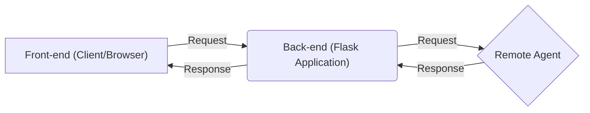
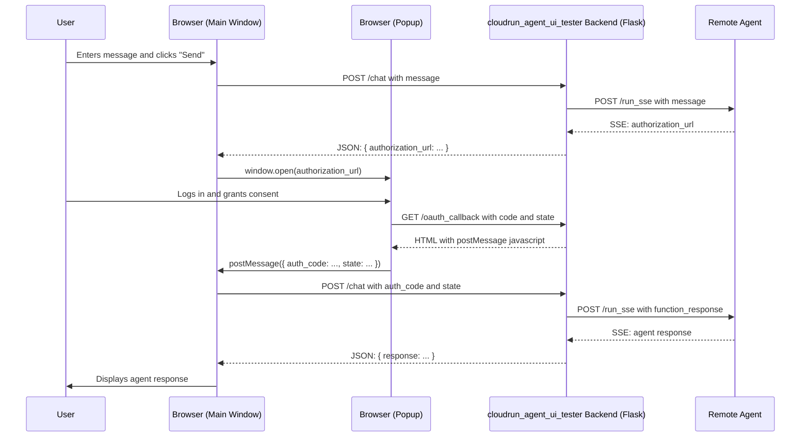

# Cloud Run Agent UI Tester

This document provides a guide on how to use and understand the Cloud Run Agent UI Tester application, a Flask-based web application for interacting with ADK agents deployed to Cloud Run and testing the OAuth2 flow.

## Overview

The Cloud Run Agent UI Tester is a simple web application that provides a chat interface for interacting with a deployed ADK agent. It demonstrates how a custom application can authenticate with an agent and handle the user-centric OAuth2 flow required by agents that use tools protected by OAuth.

## Application Architecture

The `cloudrun_agent_ui_tester` application is composed of three main components:

1.  **Front-end (Client/Browser):** This is what you see and interact with in your web browser. It is built with HTML, CSS, and Javascript.
2.  **Back-end (Flask Application):** This is the Python server (`main.py`) that runs on your local machine. It acts as a bridge between the front-end and the remote agent.
3.  **Remote Agent (Cloud Run):** This is the ADK agent that is deployed on Google Cloud Run.

Here is a diagram that illustrates the architecture:



**Explanation of Terminology:**

*   **Front-end (Client/Browser):**
    *   **What it is:** The HTML, CSS, and Javascript code in the `templates/index.html` file that is rendered by your web browser.
    *   **What it does:**
        *   Displays the chat interface.
        *   Captures your messages.
        *   Sends your messages to the Back-end.
        *   Receives responses from the Back-end and displays them in the chat window.
        *   Opens the OAuth popup window.

*   **Back-end (Flask Application):**
    *   **What it is:** The Python script `main.py` running as a Flask server.
    *   **What it does:**
        *   Serves the Front-end to your browser.
        *   Receives requests from the Front-end (e.g., when you send a message).
        *   Forwards your messages to the Remote Agent.
        *   Receives responses from the Remote Agent.
        *   Parses the agent's responses (e.g., to find the `authorization_url`).
        *   Sends the processed responses back to the Front-end.
        *   Manages the chat session.

*   **Remote Agent:**
    *   **What it is:** The deployed ADK agent.
    *   **What it does:**
        *   Receives and understands your messages.
        *   Uses its tools to perform tasks (e.g., get directions).
        *   Initiates the OAuth flow when a protected tool is needed.
        *   Sends its responses back to the Back-end.

So, in the statement "The /chat endpoint parses the agent's response, finds the authorization_url, and sends it back to the front-end," it means the **Back-end** is receiving a response from the **Remote Agent**, and then sending the relevant information to the **Front-end**.

## How to Run the Application

### 1. Install Dependencies

Install the necessary Python packages using pip:

```bash
pip install -r requirements.txt
```

### 2. Configure the Agent URL

The application needs to know the URL of the agent it will be communicating with. You can configure this in two ways:

*   **Environment Variable (Recommended):** Set the `AGENT_URL` environment variable before running the application.

    ```bash
    export AGENT_URL=<your_agent_url>
    python main.py
    ```

*   **Default Value:** If the `AGENT_URL` environment variable is not set, the application will default to `http://localhost:8000`.

### 3. Run the Application

Start the Flask web server:

```bash
python main.py
```

The application will be available at `http://127.0.0.1:8080`.
4.  The `/chat` endpoint parses the agent's response, finds the `authorization_url`, stores the necessary `auth_config` and `function_call_id` in the server-side session, and sends the URL back to the front-end.

## How to Use the UI

When you open the application in your browser, you will see the following elements:

*   **Agent URL:** A text box that shows the URL of the agent the application is configured to communicate with. You can edit this URL to test against different agents.
*   **Session ID:** Displays the ID of the current chat session. A session is required to have a conversation with the agent.
*   **New Session Button:** Creates a new chat session.
*   **Delete Session Button:** Deletes the current chat session.
*   **Chat Window:** Displays the conversation with the agent.
*   **Message Input:** The text box where you can type your messages to the agent.

## Implementing the OAuth2 Flow in a Front-end Application

The core of this application is its handling of the OAuth2 flow. Here is a step-by-step guide on how it works, with code snippets from this application as examples.

### Step 1: Initiating the Chat and Triggering the OAuth Flow

When the user sends a message that requires an OAuth-protected tool, the agent responds with a request for authentication.

1.  The user sends a message. The front-end makes a `POST` request to the `/chat` endpoint.

    *index.html:*
    ```javascript
    messageForm.addEventListener('submit', async (e) => {
        // ...
        const response = await fetch('/chat', {
            method: 'POST',
            headers: {
                'Content-Type': 'application/json'
            },
            body: JSON.stringify({ message, agent_url })
        });
        const data = await response.json();
        if (data.authorization_url) {
            // The agent needs authentication. Open in a new popup window.
            window.open(data.authorization_url, 'oauth_popup', 'width=600,height=700');
        }
        // ...
    });
    ```

2.  The `/chat` endpoint in `main.py` forwards the message to the agent.
```
--- Chat Request ---
URL: <YOUR_CLOUD_RUN_AGENT_URL>/run_sse
Headers: {"Content-Type": "application/json", "Origin": "http://127.0.0.1:8080", "Referer": "http://127.0.0.1:8080/", "Accept": "text/event-stream"}
Body: {
  "appName": "route_planner_agent",
  "userId": "user",
  "sessionId": "e3fc266f-a51c-4726-af27-66774f81d510",
  "newMessage": {
    "role": "user",
    "parts": [
      {
        "text": "route from atlanta ga to apex nc by car"
      }
    ]
  },
  "stateDelta": null,
  "streaming": false
}
--------------------------
```

3.  The agent determines that the requested tool requires authentication and responds with an `authorization_url`.

```
--- Chat Response ---
Status Code: 200
Headers: {"content-type": "text/event-stream; charset=utf-8", "date": "Mon, 27 Oct 2025 14:54:25 GMT", "server": "Google Frontend", "Transfer-Encoding": "chunked"}
--------------------------
SSE Data: data: {"content":{"parts":[{"thoughtSignature":"<THOUGHT_SIGNATURE>","functionCall":{"id":"adk-44b8dd48-76d7-421a-a21f-c4b31f7f5370","args":{"destination":"apex nc","travel_mode":"DRIVE","origin":"atlanta ga"},"name":"get_directions"}}],"role":"model"},"finishReason":"STOP","usageMetadata":{"candidatesTokenCount":14,"candidatesTokensDetails":[{"modality":"TEXT","tokenCount":14}],"promptTokenCount":667,"promptTokensDetails":[{"modality":"TEXT","tokenCount":667}],"thoughtsTokenCount":119,"totalTokenCount":800,"trafficType":"ON_DEMAND"},"avgLogprobs":-1.1913706915719169,"invocationId":"e-0b10a1ad-0319-4731-851c-6dee1304e7e3","author":"route_planning_agent","actions":{"stateDelta":{},"artifactDelta":{},"requestedAuthConfigs":{},"requestedToolConfirmations":{}},"longRunningToolIds":[],"id":"38a369a0-8db5-4424-b72c-b899b27cd8e7","timestamp":1761576864.179443}
SSE Data: data: {"content":{"parts":[{"functionCall":{"id":"adk-571e5012-20f9-4f46-aa61-aa61fb1fdc0c","args":{"functionCallId":"adk-44b8dd48-76d7-421a-a21f-c4b31f7f5370","authConfig":{"authScheme":{"type":"oauth2","flows":{"authorizationCode":{"scopes":{"https://www.googleapis.com/auth/cloud-platform":"","https://www.googleapis.com/auth/user.addresses.read":"","https://www.googleapis.com/auth/userinfo.profile":""},"authorizationUrl":"https://accounts.google.com/o/oauth2/auth","tokenUrl":"https://oauth2.googleapis.com/token"}}},"rawAuthCredential":{"authType":"oauth2","oauth2":{"clientId":"<YOUR_CLIENT_ID>","clientSecret":"<YOUR_CLIENT_SECRET>","redirectUri":"http://127.0.0.1:8080/oauth_callback"}},"exchangedAuthCredential":{"authType":"oauth2","oauth2":{"clientId":"<YOUR_CLIENT_ID>","clientSecret":"<YOUR_CLIENT_SECRET>","authUri":"https://accounts.google.com/o/oauth2/auth?response_type=code&client_id=<YOUR_CLIENT_ID>&redirect_uri=http%3A%2F%2F127.0.0.1%3A8080%2Foauth_callback&scope=https%3A%2F%2Fwww.googleapis.com%2Fauth%2Fcloud-platform+https%3A%2F%2Fwww.googleapis.com%2Fauth%2Fuser.addresses.read+https%3A%2F%2Fwww.googleapis.com%2Fauth%2Fuserinfo.profile&state=xkwVkWicfRckhmsBL9vFlyliIHEreo&access_type=offline&prompt=consent","state":"xkwVkWicfRckhmsBL9vFlyliIHEreo","redirectUri":"http://127.0.0.1:8080/oauth_callback"}},"credentialKey":"adk_oauth2_6391013025798319666_oauth2_-5762525903142597061"}},"name":"adk_request_credential"}}],"role":"user"},"invocationId":"e-0b10a1ad-0319-4731-851c-6dee1304e7e3","author":"route_planning_agent","actions":{"stateDelta":{},"artifactDelta":{},"requestedAuthConfigs":{},"requestedToolConfirmations":{}},"longRunningToolIds":["adk-571e5012-20f9-4f46-aa61-aa61fb1fdc0c"],"id":"2bfd1079-9a0c-46e0-8467-57c76aa68b33","timestamp":1761576865.511085}
SSE Data: data: {"content":{"parts":[{"functionResponse":{"id":"adk-44b8dd48-76d7-421a-a21f-c4b31f7f5370","name":"get_directions","response":{"result":"To get directions, I need you to sign in with your Google account first. Please follow the link to authorize me."}}}],"role":"user"},"invocationId":"e-0b10a1ad-0319-4731-851c-6dee1304e7e3","author":"route_planning_agent","actions":{"stateDelta":{},"artifactDelta":{},"requestedAuthConfigs":{"adk-44b8dd48-76d7-421a-a21f-c4b31f7f5370":{"authScheme":{"type":"oauth2","flows":{"authorizationCode":{"scopes":{"https://www.googleapis.com/auth/cloud-platform":"","https://www.googleapis.com/auth/user.addresses.read":"","https://www.googleapis.com/auth/userinfo.profile":""},"authorizationUrl":"https://accounts.google.com/o/oauth2/auth","tokenUrl":"https://oauth2.googleapis.com/token"}}},"rawAuthCredential":{"authType":"oauth2","oauth2":{"clientId":"<YOUR_CLIENT_ID>","clientSecret":"<YOUR_CLIENT_SECRET>","redirectUri":"http://127.0.0.1:8080/oauth_callback"}},"exchangedAuthCredential":{"authType":"oauth2","oauth2":{"clientId":"<YOUR_CLIENT_ID>","clientSecret":"<YOUR_CLIENT_SECRET>","authUri":"https://accounts.google.com/o/oauth2/auth?response_type=code&client_id=<YOUR_CLIENT_ID>&redirect_uri=http%3A%2F%2F127.0.0.1%3A8080%2Foauth_callback&scope=https%3A%2F%2Fwww.googleapis.com%2Fauth%2Fcloud-platform+https%3A%2F%2Fwww.googleapis.com%2Fauth%2Fuser.addresses.read+https%3A%2F%2Fwww.googleapis.com%2Fauth%2Fuserinfo.profile&state=xkwVkWicfRckhmsBL9vFlyliIHEreo&access_type=offline&prompt=consent","state":"xkwVkWicfRckhmsBL9vFlyliIHEreo","redirectUri":"http://127.0.0.1:8080/oauth_callback"}},"credentialKey":"adk_oauth2_6391013025798319666_oauth2_-5762525903142597061"}},"requestedToolConfirmations":{}},"id":"f31a1550-3269-472e-9ead-38cc59b92e62","timestamp":1761576865.510646}
SSE Data: data: {"content":{"parts":[{"text":"To get directions, I need you to sign in with your Google account first. Please follow the link to authorize me."}],"role":"model"},"finishReason":"STOP","usageMetadata":{"candidatesTokenCount":24,"candidatesTokensDetails":[{"modality":"TEXT","tokenCount":24}],"promptTokenCount":709,"promptTokensDetails":[{"modality":"TEXT","tokenCount":826}],"totalTokenCount":733,"trafficType":"ON_DEMAND"},"avgLogprobs":-0.012056652456521988,"invocationId":"e-0b10a1ad-0319-4731-851c-6dee1304e7e3","author":"route_planning_agent","actions":{"stateDelta":{},"artifactDelta":{},"requestedAuthConfigs":{},"requestedToolConfirmations":{}},"id":"1b11ce97-bb67-413f-ab07-7455bda1451a","timestamp":1761576865.514705}
```

4.  The `/chat` endpoint parses the agent's response, finds the `authorization_url`, and sends it back to the front-end.

    *main.py:*
    ```python
    # ... inside the /chat endpoint ...
    for line in response.iter_lines():
        # ... parsing logic ...
        if auth_uri_to_return:
            session['auth_config'] = auth_config_to_store
            session['function_call_id'] = function_call_id_to_store
            return jsonify({'authorization_url': auth_uri_to_return})
    ```

### Step 2: Handling the OAuth Popup

The front-end opens the `authorization_url` in a new popup window. This URL leads to the Google login and consent screen, where the user can approve the scopes requested by the agent.

### Step 3: The OAuth Callback

After the user approves the request, the OAuth provider redirects the user back to the `redirect_uri` that was specified in the `authorization_url`. In our case, this is the `/oauth_callback` endpoint.

1.  The `/oauth_callback` endpoint receives the `code` and `state` as query parameters.

2.  It then renders a simple HTML page with a javascript snippet that uses `window.opener.postMessage` to send the `code` and `state` back to the main window.

    *main.py:*
    ```python
    @app.route('/oauth_callback')
    def oauth_callback():
        # ...
        auth_code = request.args.get('code')
        state = request.args.get('state')
        return f'''
<!DOCTYPE html>
<html>
<head>
    <title>Authentication Complete</title>
            <script type="text/javascript">
                window.onload = function() {{
                    if (window.opener) {{
                        window.opener.postMessage({{ 'auth_code': '{auth_code}', 'state': '{state}' }}, window.opener.location.origin);
                        window.close();
                    }} 
                    }} else {{ document.body.innerHTML = "<h1>Error: Not in a popup.</h1>"; }}
                }};
            </script>
        '''
</head>
<body><p>Authentication complete. You can close this window.</p></body>
</html>'''
    ```

### Step 4: Completing the Authentication

The main window receives the `postMessage` event and now has the `code` and `state` needed to complete the authentication.

1.  The `message` event listener in `index.html` is triggered.

2.  It makes a `POST` request to the `/chat` endpoint, this time including the `auth_code` and `state`.

    *index.html:*
    *templates/index.html:*
    ```javascript
    window.addEventListener('message', async (event) => {
        if (event.origin === window.location.origin && event.data.auth_code) {
        if (event.origin !== window.location.origin) return;
        if (!event.data || !event.data.auth_code) return;

        const { auth_code, state } = event.data;
        if (auth_code) {
            appendMessage('System', 'Authentication complete. Fetching final response...', 'system-message');
            const { auth_code, state } = event.data;
            const agent_url = agentUrlInput.value;
            const requestBody = { auth_code, state, agent_url };

            const response = await fetch('/chat', {
                method: 'POST',
                // ...
                body: JSON.stringify(requestBody)
            });
            // ...
            try {
                const response = await fetch('/chat', {
                    method: 'POST',
                    headers: { 'Content-Type': 'application/json' },
                    body: JSON.stringify({ auth_code, state, agent_url })
                });

                // ... handle final response from agent
            } catch (error) {
                appendMessage('Error', `Auth fetch error: ${error.message}`, 'agent-message');
            }
        }
    });
    ```

3.  The `/chat` endpoint in `main.py` now has the `auth_code`. It retrieves the `auth_config` and `function_call_id` that it had previously stored in the session, constructs a `function_response` payload, and sends it to the agent.

    *main.py:*
    ```python
    # ... inside the /chat endpoint ...
    if auth_code:
        # ...
        auth_config['exchangedAuthCredential']['oauth2']['authResponseUri'] = f"http://127.0.0.1:8080/oauth_callback?state={state}&code={auth_code}"
        data = {
            "appName": app_name,
            "userId": "user",
            "sessionId": session_id,
            "newMessage": {
                "role": "user",
                "parts": [{
                    "function_response": {
                        "id": function_call_id,
                        "name": "adk_request_credential",
                        "response": auth_config
                    }
                }]
            }
        }
    ```

Here is an example of the call to the agent:

```
--- Chat Request ---
URL: <YOUR_CLOUD_RUN_AGENT_URL>/run_sse
Headers: {"Content-Type": "application/json", "Origin": "http://127.0.0.1:8080", "Referer": "http://127.0.0.1:8080/", "Accept": "text/event-stream"}
Body: {
  "appName": "route_planner_agent",
  "userId": "user",
  "sessionId": "e3fc266f-a51c-4726-af27-66774f81d510",
  "newMessage": {
    "role": "user",
    "parts": [
      {
        "function_response": {
          "id": "adk-571e5012-20f9-4f46-aa61-aa61fb1fdc0c",
          "name": "adk_request_credential",
          "response": {
            "authScheme": {
              "flows": {
                "authorizationCode": {
                  "authorizationUrl": "https://accounts.google.com/o/oauth2/auth",
                  "scopes": {
                    "https://www.googleapis.com/auth/cloud-platform": "",
                    "https://www.googleapis.com/auth/user.addresses.read": "",
                    "https://www.googleapis.com/auth/userinfo.profile": ""
                  },
                  "tokenUrl": "https://oauth2.googleapis.com/token"
                }
              },
              "type": "oauth2"
            },
            "credentialKey": "adk_oauth2_6391013025798319666_oauth2_-5762525903142597061",
            "exchangedAuthCredential": {
              "authType": "oauth2",
              "oauth2": {
                "authUri": "https://accounts.google.com/o/oauth2/auth?response_type=code&client_id=<YOUR_CLIENT_ID>&redirect_uri=http%3A%2F%2F127.0.0.1%3A8080%2Foauth_callback&scope=https%3A%2F%2Fwww.googleapis.com%2Fauth%2Fcloud-platform+https%3A%2F%2Fwww.googleapis.com%2Fauth%2Fuser.addresses.read+https%3A%2F%2Fwww.googleapis.com%2Fauth%2Fuserinfo.profile&state=xkwVkWicfRckhmsBL9vFlyliIHEreo&access_type=offline&prompt=consent",
                "clientId": "<YOUR_CLIENT_ID>",
                "clientSecret": "<YOUR_CLIENT_SECRET>",
                "redirectUri": "http://127.0.0.1:8080/oauth_callback",
                "state": "xkwVkWicfRckhmsBL9vFlyliIHEreo",
                "authResponseUri": "http://127.0.0.1:8080/oauth_callback?state=xkwVkWicfRckhmsBL9vFlyliIHEreo&code=<AUTH_CODE>"
              }
            },
            "rawAuthCredential": {
              "authType": "oauth2",
              "oauth2": {
                "clientId": "<YOUR_CLIENT_ID>",
                "clientSecret": "<YOUR_CLIENT_SECRET>",
                "redirectUri": "http://127.0.0.1:8080/oauth_callback"
              }
            }
          }
        }
      }
    ]
  }
}
--------------------------
```

4.  The agent receives the `function_response`, exchanges the `auth_code` for an access token, and can now execute the OAuth-protected tool.

```
--- Chat Response ---
Status Code: 200
Headers: {"content-type": "text/event-stream; charset=utf-8", "date": "Mon, 27 Oct 2025 14:54:53 GMT", "server": "Google Frontend", "Transfer-Encoding": "chunked"}
--------------------------
SSE Data: data: {"content":{"parts":[{"functionResponse":{"id":"adk-44b8dd48-76d7-421a-a21f-c4b31f7f5370","name":"get_directions","response":{"result":"Directions from 'atlanta ga' to 'apex nc' by drive:\n  - Total Distance: 632.0 km\n  - Estimated Duration: about 360 minutes.\n  - Steps:\n    1. Head southwest toward Capitol Sq SW\n    2. Turn left onto Capitol Sq SW\n    3. Turn left onto Capitol Ave SW\n    4. Turn right onto M.L.K. Jr Dr SE\n    5. Turn left to merge onto I-75 N/I-85 N\n    6. Take exit 251B on the left for I-85 N toward GA-400/Greenville\n    7. Continue onto I-85 N\n    8. Keep right to stay on I-85 N, follow signs for Greenville\nEntering South Carolina\n    9. Continue straight to stay on I-85 N\nEntering North Carolina\n    10. Keep left to stay on I-85 N, follow signs for US 421 S/Durham Sanford\n    11. Take exit 126A-126B to merge onto US-421 S toward Sanford\n    12. Slight right\n    13. Merge onto US-421 S\n    14. Take exit 171 for US-64 E toward Pittsboro\n    15. Turn left onto US-64 E\nPass by Wendy's (on the right in 0.4 mi)\n    16. Take the exit toward Apex/Downtown\n    17. Turn right onto N Salem St\n    18. Continue straight to stay on N Salem St"}}}],"role":"user"},"invocationId":"e-37780700-6f32-4157-85aa-0e22f7e57838","author":"route_planning_agent","actions":{"stateDelta":{"route_planner_creds":"{\"token\": \"<ACCESS_TOKEN>\", \"refresh_token\": \"<REFRESH_TOKEN>\", \"token_uri\": \"https://oauth2.googleapis.com/token\", \"client_id\": \"<YOUR_CLIENT_ID>\", \"client_secret\": \"<YOUR_CLIENT_SECRET>\", \"universe_domain\": \"googleapis.com\", \"account\": \""}"},"artifactDelta":{},"requestedAuthConfigs":{},"requestedToolConfirmations":{}},"id":"aa73bb11-8298-4589-b8f6-b85276d0369d","timestamp":1761576893.902141}
SSE Data: data: {"content":{"parts":[{"text":"Directions from 'atlanta ga' to 'apex nc' by drive:\n  - Total Distance: 632.0 km\n  - Estimated Duration: about 360 minutes.\n  - Steps:\n    1. Head southwest toward Capitol Sq SW\n    2. Turn left onto Capitol Sq SW\n    3. Turn left onto Capitol Ave SW\n    4. Turn right onto M.L.K. Jr Dr SE\n    5. Turn left to merge onto I-75 N/I-85 N\n    6. Take exit 251B on the left for I-85 N toward GA-400/Greenville\n    7. Continue onto I-85 N\n    8. Keep right to stay on I-85 N, follow signs for Greenville\nEntering South Carolina\n    9. Continue straight to stay on I-85 N\nEntering North Carolina\n    10. Keep left to stay on I-85 N, follow signs for US 421 S/Durham Sanford\n    11. Take exit 126A-126B to merge onto US-421 S toward Sanford\n    12. Slight right\n    13. Merge onto US-421 S\n    14. Take exit 171 for US-64 E toward Pittsboro\n    15. Turn left onto US-64 E\nPass by Wendy's (on the right in 0.4 mi)\n    16. Take the exit toward Apex/Downtown\n    17. Turn right onto N Salem St\n    18. Continue straight to stay on N Salem St\n"}],"role":"model"},"finishReason":"STOP","usageMetadata":{"candidatesTokenCount":356,"candidatesTokensDetails":[{"modality":"TEXT","tokenCount":356}],"promptTokenCount":1040,"promptTokensDetails":[{"modality":"TEXT","tokenCount":1157}],"totalTokenCount":1396,"trafficType":"ON_DEMAND"},"avgLogprobs":-0.0005882966719316633,"invocationId":"e-37780700-6f32-4157-85aa-0e22f7e57838","author":"route_planning_agent","actions":{"stateDelta":{},"artifactDelta":{},"requestedAuthConfigs":{},"requestedToolConfirmations":{}},"id":"3bffa1cf-5a0e-42e5-b390-0c521ea6d8dd","timestamp":1761576893.904266}
```

## Session Management

The application uses Flask's session management to maintain a consistent conversation with the agent. The session ID is stored in a cookie in the user's browser.

The `/session` endpoint provides a simple RESTful interface for managing the session:

*   `GET /session`: Retrieves the current session ID.
*   `POST /session`: Creates a new session.
*   `DELETE /session`: Deletes the current session.

## Sequence Diagram

