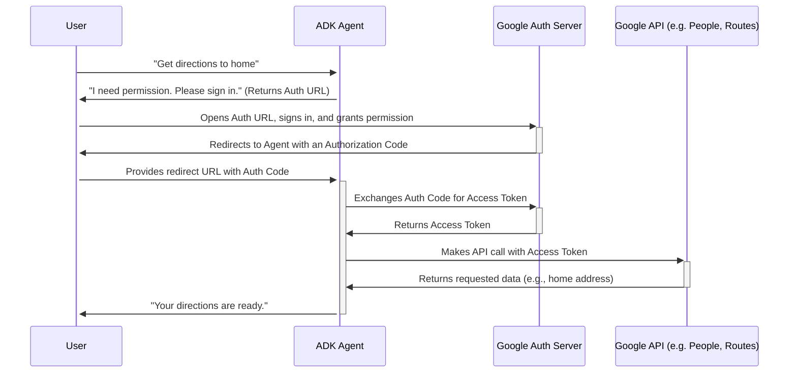

# Route Planner Agent

This agent demonstrates how to implement the user-centric OAuth 2.0 authorization flow within an ADK agent, enabling tools to access Google Cloud APIs that require user authentication. It provides two main functions:

1.  `get_directions`: Fetches driving, walking, or transit directions using the Google Routes API.
2.  `get_address_of_place`: Finds the address for a named place. It uses the Google Places API for general searches and the Google People API to find the user's "home" or "work" address.

The key feature of this agent is its use of the `oauth_helper.py` module to manage the entire OAuth 2.0 Authorization Code Grant Flow, which is necessary for accessing user-specific data.

## Understanding the OAuth 2.0 Flow

OAuth 2.0 is a standard that allows an application (like this agent) to obtain limited access to a user's account on an HTTP service, such as Google. The **Authorization Code Grant Flow** is one of the most common and secure OAuth 2.0 flows, and it's the one used by this agent.

Here's a simplified overview of the roles and steps:

*   **Resource Owner**: The user who is granting permission.
*   **Client**: The application (our agent) requesting access.
*   **Authorization Server**: The server that authenticates the user and issues access tokens (e.g., Google's authentication server).
*   **Resource Server**: The server hosting the protected data (e.g., Google People API, Routes API).

The flow works as follows: The agent asks the user for permission. The user is redirected to Google to sign in and approve the request. If approved, Google sends the user back to the agent with a temporary **authorization code**. The agent then secretly exchanges this code with Google's server for a long-lived **access token**. This token is the key that the agent uses to make API requests on the user's behalf.



## Implementation of the OAuth 2.0 Flow in the Agent

The `oauth_helper.py` module contains the `get_user_credentials` function, which is the core of the agent's authentication logic. It follows the standard OAuth 2.0 Authorization Code flow.

Here is a step-by-step breakdown of the process:

1.  **Check for Cached Credentials**: The first step in `get_user_credentials` is to check if valid credentials already exist in the user's session state (`tool_context.state`).
    *   If cached credentials are found, it checks if the access token has expired.
    *   If the access token is expired but a **refresh token** is available, it automatically uses the refresh token to request a new access token from Google's token endpoint. This happens silently without requiring user interaction.

2.  **Initiate New Auth Flow**: If no valid or refreshable credentials are found, the agent initiates a new authentication flow.
    *   It calls `tool_context.request_credential()`, passing an `AuthConfig` object. This object contains the `client_id`, `client_secret`, `redirect_uri`, and the required `scopes` (permissions) that the agent needs.

3.  **User Authorization**: The ADK framework intercepts this request and generates a unique authorization URL.
    *   The agent returns this URL to the user with a message asking them to sign in.
    *   The user opens the URL, signs into their Google account, and reviews the requested permissions (e.g., "Read your addresses").
    *   If the user clicks "Allow", Google redirects their browser back to the `redirect_uri` that was configured in the Google Cloud Console. This redirect includes a temporary **authorization code**.

4.  **Token Exchange**: The ADK framework captures this authorization code from the redirect.
    *   On the next tool call, the framework passes the authorization code back to the `get_user_credentials` function via `tool_context.get_auth_response()`.
    *   The helper function then securely exchanges this code (along with the `client_id` and `client_secret`) for an **access token** and a **refresh token** by making a server-to-server call to Google's token endpoint.

5.  **Cache and Use Credentials**:
    *   The newly acquired tokens are stored in the user's session state (`tool_context.state`).
    *   The access token is then used to make the authenticated API call (e.g., to the People API or Routes API).

This cycle ensures that the user only needs to go through the full sign-in and consent process once. Subsequent requests will use the cached tokens, and the long-lived refresh token will keep the session active across multiple conversations.

## How to Set Up and Run

1. **Create a virtual environment and install dependencies:**
   ```bash
   python3 -m venv venv
   source venv/bin/activate
   pip install -r requirements.txt
   ```

2. **Set up your Google Cloud project:**
   - Create a new Google Cloud project (or use an existing one).
   - Enable the following APIs in your project:
     - Routes API
     - Places API
     - People API
    ```
     gcloud services enable routes.googleapis.com
     gcloud services enable places.googleapis.com
     gcloud services enable people.googleapis.com
    ``` 
   - Make sure you have billing enabled for your project.

3. **Configure the OAuth Consent Screen:**
   - In the Google Cloud Console, go to the [OAuth consent screen page](https://console.cloud.google.com/apis/credentials/consent).
   - Choose "External" for the user type.
   - Fill in the required information, such as the app name, user support email, and developer contact information.
   - On the "Scopes" page, you don't need to add any scopes manually. The agent will request them dynamically.
   - On the "Test users" page, add the Google accounts of the users who will be testing the agent. While the app is in "Testing" mode, only these users will be able to grant permissions.

4. **Configure OAuth 2.0 credentials:**
To allow the agent to request permissions from users, you need to create an OAuth 2.0 Client ID.

    1.  **Go to the Google Cloud Console Credentials page.**
    2.  Select your project.
    3.  Click **+ CREATE CREDENTIALS** and choose **OAuth client ID**.
    4.  Select **Web application** for the Application type.
    5.  Give it a name (e.g., "Route Planner Agent").
    6.  Under **Authorized redirect URIs**, click **+ ADD URI** and add the following two URIs:
        *   `http://127.0.0.1:8000/dev-ui/` (for use with the `adk web` UI)
        *   `http://localhost:8080` (for local testing with `test_people_api.py`)
    7.  Click **CREATE**. You will be shown a **Client ID** and **Client secret**.

5. **Configure your environment variables:**
   - Create a `.env` file in the `route_planner_agent` directory.
   - Add the following variables to the `.env` file, replacing the placeholder values with your actual credentials:
     ```
     GOOGLE_CLIENT_ID="YOUR_CLIENT_ID"
     GOOGLE_CLIENT_SECRET="YOUR_CLIENT_SECRET"
     AGENT_REDIRECT_URI="http://localhost:8080/"
     GOOGLE_CLOUD_PROJECT_ID="YOUR_PROJECT_ID"
     ```

6. **Run the agent:**
   ```bash
   adk web
   ```
   The agent will start and be accessible through the ADK's web-based chat interface.

7. **Interact with the agent:**
   - When you first use a command that requires authentication (like `get_directions`), the agent will provide a URL for you to sign in with your Google account.
   - Open the URL in your browser, sign in, and grant the requested permissions.
   - After you authorize the agent, it will be able to execute the commands on your behalf.
   - **Example:**
     > "Get me directions from the Eiffel Tower to the Louvre Museum by walking."


